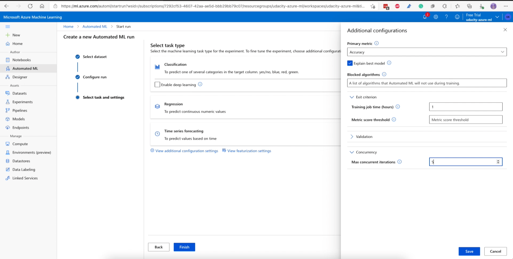

# Operationalizing Machine Learning

This project is part of the Udacity Machine Learning with Azure Nanodegree. In this project, we use Azure ML Studio to train a machine learning model with AutoML, deploy the best model as REST endpoint, and consume it. We also create a AutoML and Endpoint pipeline, publish and consume it using python-sdk.


## Architectural Diagram


The project mainly has 6 stages:

1. Authentication - We have created a Service Principle (SP) and allow the SP access to ML workspace. This ensures azure cli and Python azure-sdk will be able to access the ML worksapce and manage resources.
2. Creating AutoML Experiment - An AutoML experiment is created using Bankmarketing dataset and relavent compute resources are allocated and with a Exit Criteria.
3. Deploy best performing model - VotingEnsemble Classifier, which was the best performing model of all models generated by AutoML experiement is deployed as an RESTFul service.
4. Enable logging - Logging (Application Monitoring and Insights) is enabled by using a python script logging.py, which uses azure-ml sdk.
5. Consume Best using Model REST endpoint - After model is deployed as an endpoint, it is accesible via secure URL with authentication. Load testing is also performed to analyse the model responsiveness.
6. Create pipeline with AutoML and REST endpoint - A pipeline with AutoML model and REST Endpoint is created using azure-ml python SDK. This is useful in completely automating the model training and deployment process.


## Key Steps


### 1. Authentication

In this step, we need to install the Azure Machine Learning Extension which allows us to interact with Azure Machine Learning Studio, part of the `az` command. After having the Azure machine Learning Extension, we need to create a `Service Principal` account and associate it with the specific ML workspace.

```bash
az ad sp create-for-rbac --sdk-auth --name ml-auth
```

Running this command should generate a Service Principle as shown in the below screenshot.


Figure 1 - Creation of Service Principle


The Service Principal created in the above step can be verified sing the below command :


```bash
az ad sp show --id <your-client-id>
```


Figure 2 - Displaying the Service Principle


### 2. Creating AutoML Experiment

In this step, we will create an experiment using **Automated ML**, configure a compute cluster, and use that cluster to run the experiment.

Figure 3 - Displaying the bankmarketing dataset in ML Studio -> Datasets


The AutoML experiment is created using Bankmarketing dataset and relavent compute resources are allocated and with a Exit Criteria.

Figure 4 - Bankmarketing dataset is selected while creating AutoML experiment.


We need to configure a new compute cluster Standard_DS12_v2  for the Virtual Machine Size and select 1 as the number of minimum nodes.


Figure 5 - Compute specs are provided while creating AutoML experiment


Figure 6 - Experiment name, Compuet target, Target variable is selected before creating AutoML experiment


On Exit criterion, reduce the default (3 hours) to 1 and reduce the Concurrency from default to 5 (this number should always be less than the number of the compute cluster)


Figure 7 - Exit creiteria like training job time, concurrency are configured before creating AutoML experiment




Once the AutoML experiment is created, it takes few minutes to setup the computing infra.

Figure 8 - AutoML experiment in creation state.


Once the experiment gets initated, AutoML would train multiple models and depending on the Exit criterion we have provided, it will comeup with a best performing model.


Figure 9 - AutoML experiment completed.


In the experiment I have run, VotingEnseble model was the best performing model with accuracy of 0.91927.

Figure 10 - List of AutoML models created


Figure 11 - Best AutoML model created was VotingEnsemble Classifier


We can look into the Metrics section of the best performing model. AutoML experiment provides metrics like accuracy, AUC_ROC graphs, f1_score etc. These metrics can vary depending on the kind of problem type we are using. (Classification or Reegression)


Figure 12 - VotingEnsemble Classifier metrics


## 3. Deploy best performing model & Enable logging


We choose the best model for deployment and enabled "Authentication" while deploying the model using Azure Container Instance (ACI) as compute type.


Figure 13 - Creation of Model Endpoint


Now that the *Best Model* is deployed, we need to enable Application Insights and retrieve logs. Although this is configurable at deploy time with a check-box, we chose to use the Python SDK to enable the logs using the script.


Figure 14 - Output from logs.py after enabling Application Monitoring and Insights


The executed code in logs.py enables Application Insights. "Application Insights enabled" is disabled before executing logs.py.

Figure 15 - Endpoint details showing Application Monitoring and Insights enabled post logs.py script is executed


## 4. Consume Best using Model REST endpoint


In this step, we will consume the deployed model using Swagger.

Azure provides a [Swagger JSON file](https://swagger.io/) for deployed models. Head to the *Endpoints* section, and find your deployed model there, it should be the first one on the list.

To access the Swagger documentation, we need to use swagger.sh and server.py scripts.

1. `swagger.sh` will download the latest Swagger container, and it will run it on port 80. If you don't have permissions for port 80 on your computer, update the script to a higher number (above 9000 is a good idea).
2. `serve.py` will start a Python server on port `8000`. This script needs to be right next to the downloaded `swagger.json` file. **NOTE:** this will not work if `swagger.json` is not on the same directory.


Figure 16 - Swagger documentation running locally showing deployed endpoint specs


Figure 17 - Swagger documentation running locally showing deployed endpoint specs


Once the model is deployed, we need to use the `endpoint.py` script provided to interact with the trained model. In this step, we need to run the script, modifying both the `scoring_uri` and the `key` to match the key for your service and the URI that was generated after deployment. This URI can be found in the *Details* tab, above the *Swagger URI*.

Figure 18 - Endpoint output from endpoint.py script


## Benchmarking

The deployed endpoint is load tested using ab - Apache HTTP benchmarking tool, which will give us statistics on performance of the model interms of concurrency and response times.

The benchmarking script can be run using:

```bash
./endpoint.sh
```


Figure 19 - ab benchmarking tool results in the terminal


## 5. Create pipeline with AutoML and REST endpoint


In this step, we will use the Jupyter Notebook provided in the starter files. We must make sure to update the notebook to have the same keys, URI, dataset, cluster, and model names already created.


Figure 20 - Notebook for creating Pipelien with AutoML and Model Endpoint


Figure 21 - Bankmarketing dataset added to Datasets using python sdk


Figure 22 - Notebook showing running state of Pipeline run


Figure 23 - Running state of Pipeline


Figure 24 - Notebook showing dataset metrics


Figure 25 - Notebook showing published state of Pipeline endpoint run


Figure 26 - Final state of Pipeline endpoint, with REST endpoint


Figure 27 - List of Pipeline Endpoints on Workspace -> Pipelines -> Pipeline Endpoint


## Screen Recording

[https://www.youtube.com/watch?v=GXHygBldfEg](https://www.youtube.com/watch?v=GXHygBldfEg)


## Standout Suggestions

- One of the suggestion from this AutoML run was the imbalanced data issue which can be observed in Data guardriles section of the experiment run.
- This can lead to biased prediction, which can affect negatively the model's accuracy.
