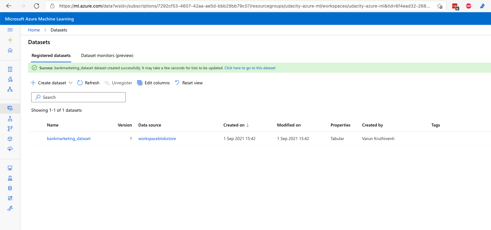

# Operationalizing Machine Learning

This project is part of the Udacity Machine Learning with Azure Nanodegree. In this project, we use Azure ML Studio to train a machine learning model with AutoML, deploy the best model as REST endpoint, and consume it. We also create a AutoML and Endpoint pipeline, publish and consume it using python-sdk.

## Architectural Diagram

The project mainly has 6 stages:

1. Authentication - We have created a Service Principle (SP) and allow the SP access to ML workspace. This ensures azure cli and Python azure-sdk will be able to access the ML worksapce and manage resources.
2. Creating AutoML Experiment - An AutoML experiment is created using Bankmarketing dataset and relavent compute resources are allocated and with a Exit Criteria.
3. Deploy best performing model - VotingEnsemble Classifier, which was the best performing model of all models generated by AutoML experiement is deployed as an RESTFul service.
4. Enable logging - Logging (Application Monitoring and Insights) is enabled by using a python script logging.py, which uses azure-ml sdk.
5. Consume Best using Model REST endpoint - After model is deployed as an endpoint, it is accesible via secure URL with authentication. Load testing is also performed to analyse the model responsiveness.
6. Create pipeline with AutoML and REST endpoint - A pipeline with AutoML model and REST Endpoint is created using azure-ml python SDK. This is useful in completely automating the model training and deployment process.

## Key Steps

### 1. Authentication

We have created a Service Principle (SP) and allow the SP access to ML workspace. This ensures azure cli and Python azure-sdk will be able to access the ML worksapce and manage resources.

Figure 1 - Creation of Service Principle

Figure 2 - Displaying the Service Principle

### 2. Creating AutoML Experiment

An AutoML experiment is created using Bankmarketing dataset and relavent compute resources are allocated and with a Exit Criteria.

Figure 3 - Displaying the bankmarketing dataset in ML Studio -> Datasets

Figure 4 - Bankmarketing dataset is selected while creating AutoML experiment.

Figure 4 - Compute specs are provided while creating AutoML experiment

Figure 5 - Experiment name, Compuet target, Target variable is selected before creating AutoML experiment

Figure 6 - Exit creiteria like training job time, concurrency are configured before creating AutoML experiment

Figure 6 - AutoML experiment in creation state.

Figure 7 - AutoML experiment created.

Figure 8 - List of AutoML models created

Figure 9 - Best AutoML model created was VotingEnsemble Classifier

Figure 10 - VotingEnsemble Classifier metrics

## 3. Deploy best performing model & Enable logging

VotingEnsemble Classifier, which was the best performing model of all models generated by AutoML experiement is deployed as an RESTFul service.

We choose the best model for deployment and enabled "Authentication" while deploying the model using Azure Container Instance (ACI) as compute type.

Figure 11 - Creation of Model Endpoint

Figure 12 - Output from logs.py after enabling Application Monitoring and Insights

Figure 13 - Endpoint details shwoing Application Monitoring and Insights enabled post logs.py script is executed

## 4. Consume Best using Model REST endpoint

After model is deployed as an endpoint, it is accesible via secure URL with authentication. Load testing is also performed to analyse the model responsiveness.

Figure 14 - Swagger documentation running locally showing deployed endpoint specs

Figure 15 - Swagger documentation running locally showing deployed endpoint specs

Figure 16 - Endpoint output from endpoint.py script

## Benchmarking

The deployed endpoint is load tested using ab - Apache HTTP benchmarking tool, which will give us statistics on performance of the model interms of concurrency and response times.

Figure 17 - ab benchmarking tool results in the terminal

## 5. Create pipeline with AutoML and REST endpoint

Figure 18 - Notebook for creating Pipelien with AutoML and Model Endpoint

Figure 19 - Bankmarketing dataset added to Datasets using python sdk

Figure 20 - Notebook showing running state of Pipeline run

Figure 21 - Running state of Pipeline

Figure 22 - Notebook showing dataset metrics

Figure 23 - Notebook showing published state of Pipeline endpoint run

Figure 24 - Final state of Pipeline endpoint, with REST endpoint

Figure 25 - List of Pipeline Endpoints on Workspace -> Pipelines -> Pipeline Endpoint

## Screen Recording

[https://www.youtube.com/watch?v=GXHygBldfEg](https://www.youtube.com/watch?v=GXHygBldfEg)

## Standout Suggestions

- One of the suggestion from this AutoML run was the imbalanced data issue which can be observed in Data guardriles section of the experiment run. 
- This can lead to biased prediction, which can affect negatively the model's accuracy.
